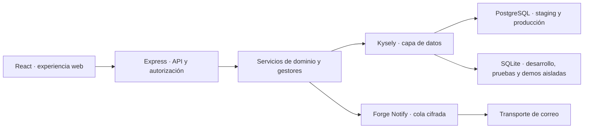

<p align="center">
  
</p>

<h1 align="center">Umbravia Forge</h1>

<p align="center">
  <strong>Plataforma modular y multi-tenant para gestionar centros deportivos, comunidad, soporte y analítica operativa.</strong>
</p>

<p align="center">
  <a href="https://github.com/jl-glX/umbravia-forge/actions/workflows/ci.yml"></a>
  
  
  
</p>

<p align="center">
  <a href="https://www.umbraviaforge.com/">Sitio web</a>
  ·
  <a href="./docs/ARCHITECTURE.md">Arquitectura</a>
  ·
  <a href="./DEVELOPMENT.md">Desarrollo</a>
  ·
  <a href="./docs/SECURITY.md">Seguridad</a>
  ·
  <a href="./docs/README.md">Documentación</a>
</p>

> [!IMPORTANT]
> Umbravia Forge está en desarrollo activo. El código puede operar Stripe en
> Test o Live de forma explícita, pero una instancia no debe aceptar pagos
> reales hasta completar precios, fiscalidad, secretos, webhooks y la prueba de
> extremo a extremo del entorno autorizado.

## Una plataforma, cada centro con su propio espacio

Umbravia Forge reúne en una misma base técnica la actividad diaria de un centro, la experiencia de sus socios y las herramientas internas necesarias para mantener el servicio. La arquitectura separa los datos por centro y conserva las credenciales, la recuperación y la seguridad de la cuenta como responsabilidades globales del usuario.

### Producto y operaciones

- **Centros y equipos:** alta de administradores, perfiles de centro, membresías y permisos por tenant.
- **Clases y reservas:** calendario, aforo, reservas, listas de espera FIFO, promociones y control de asistencia.
- **Personas:** experiencias diferenciadas para socios, entrenadores y administradores.
- **Comunidad:** perfiles sociales, contactos, canales de centro o clase, mensajería y moderación con límites de acceso explícitos.
- **Forge Analytics:** ocupación, asistencia, cancelaciones, demanda y comparativas por actividad, franja horaria y centro.
- **Forge CRM:** segmentación operativa, responsables y seguimientos por centro, sin mezclar datos entre tenants.
- **Suscripción SaaS:** Checkout, portal y señales firmadas de Stripe separados del libro administrativo de cobros a socios.
- **Forge Support:** tickets, conversaciones privadas, notas internas,
  adjuntos protegidos, SLA y base de conocimiento implementados, pero con la
  interfaz congelada y desactivada; la experiencia actual deriva a canales
  externos mientras esa frontera permanezca cerrada.
- **UMF Support:** aplicación web corporativa separada para incidencias de plataforma, cuentas verificadas con aprobación administrativa, panel de correo y canal de privacidad.
- **Cuentas y continuidad:** verificación de correo, recuperación de acceso, MFA, passkeys, sesiones revocables y cierre reversible de cuenta.
- **Forge Notify:** cola transaccional cifrada, reintentos acotados, trazabilidad, saneamiento periódico y transporte de correo desacoplado.
- **Plano de gestión interno:** coordinación de gestores, prioridades, control de conflictos y administración local Linux con allowlist operativa y ámbito `commercial` o `support` explícito; no publica consola web ni API remota.

La aplicación comercial y UMF Support comparten PostgreSQL en `staging` y
`production`, pero no comparten identidad: los realms, credenciales, cookies,
relaciones y autorizaciones son independientes. Compartir el motor no concede
acceso cruzado ni convierte la cuenta de un centro en personal corporativo.

### Principios de diseño

| Principio              | Aplicación práctica                                                                                       |
| ---------------------- | --------------------------------------------------------------------------------------------------------- |
| Aislamiento por centro | El servidor resuelve el tenant y comprueba la membresía antes de acceder a datos operativos.              |
| Seguridad por defecto  | Validación, autorización, límites, sesiones revocables y cifrado independiente por dominio sensible.      |
| Portabilidad           | Desarrollo compatible con Windows, Linux y WSL; producción sin dependencia operativa de Windows.          |
| Cambios verificables   | Migraciones versionadas, pruebas de aislamiento, paquetes auditados y despliegues con rollback.           |
| Modularidad            | Los gestores operan su área; el coordinador y el núcleo regulan conexiones, conflictos y prioridades.     |
| Datos con propósito    | La analítica evita inventar causalidad y mantiene separadas identidad, soporte, facturación y telemetría. |

## Arquitectura



Las decisiones y fronteras completas están documentadas en [Arquitectura](./docs/ARCHITECTURE.md), [migración multi-tenant](./docs/MULTI-TENANT-MIGRATION.md) y [núcleo de gestores](./docs/MANAGER-CORE.md).

## Tecnologías

| Capa      | Tecnologías principales                                                                                            |
| --------- | ------------------------------------------------------------------------------------------------------------------ |
| Interfaz  | React 19, TypeScript 7 nativo, Vite 8, Tailwind CSS 4, i18next                                                     |
| API       | Node.js 24 LTS, Express 5, validación y middleware de autorización                                                 |
| Datos     | Kysely, PostgreSQL, SQLite para entornos aislados                                                                  |
| Seguridad | Argon2id, WebAuthn/passkeys, TOTP y AES-256-GCM versionado; lectura legacy XChaCha20-Poly1305 durante la migración |
| Calidad   | Vitest, ESLint, Prettier, auditoría de dependencias y GitHub Actions                                               |
| Edge      | Cloudflare Turnstile y despliegues separados del Worker de entrada de correo                                       |

El cambio activo materializa los locales internos `es`, `en`, `de`, `de-CH`,
`fr`, `it`, `gl`, `ca`, `ca-valencia`, `eu` y `oc-aranes`. Las auditorías
internas estructurales, lingüísticas y de coincidencias hash-pinned están
cerradas, pero la rama no será entregable hasta superar la revisión final del
diff y la validación global. Las variantes
regionales heredan de su catálogo base y los formatos pasan por una resolución
explícita hacia etiquetas compatibles con `Intl`. La capacidad técnica de
seleccionar o persistir un locale no equivale a disponibilidad lingüística,
revisión nativa ni validación en producción; el estado verificable de cada
catálogo se mantiene en
[`docs/LOCALIZATION.md`](docs/LOCALIZATION.md).

## Desarrollo local

### Requisitos

- Node.js `>=24.15.0 <25`
- npm `>=11.18.0 <12`

### Puesta en marcha

```bash
npm ci
npm run dev
```

El lanzador inicia ambos servicios:

- interfaz: <http://127.0.0.1:3000>
- API: <http://127.0.0.1:3001>

Los valores predeterminados sirven para el entorno local. Copia `.env.example` a `.env` únicamente si necesitas ajustes propios y no incorpores secretos, bases de datos ni datos reales al repositorio.

## Calidad y validación

El control local completo es:

```bash
npm run ci:validate
```

Este comando comprueba portabilidad, formato, lint, tipos, pruebas, compilaciones y dependencias. GitHub Actions repite la validación sobre Linux y audita además el paquete de despliegue.

| Comando                  | Uso                                                                 |
| ------------------------ | ------------------------------------------------------------------- |
| `npm run test:watch`     | Sesión persistente de pruebas durante el desarrollo.                |
| `npm run format`         | Aplica el formato del repositorio.                                  |
| `npm run typecheck`      | Valida los contratos TypeScript del cliente, servidor y Worker.     |
| `npm run build`          | Compila todos los artefactos de la aplicación.                      |
| `npm run deploy:package` | Prepara y audita un paquete Linux sin secretos ni datos locales.    |
| `npm run security:probe` | Ejecuta la sonda local autorizada contra una API en funcionamiento. |

Consulta [DEVELOPMENT.md](./DEVELOPMENT.md) para conocer el flujo de trabajo, las convenciones y los límites de los entornos.

## Estructura del repositorio

```text
client/       interfaz React, recursos de marca e internacionalización
server/       API, servicios, autorización, datos y migraciones
cloudflare/   Worker de entrada para el correo de soporte
deploy/       unidades y comprobaciones de despliegue Linux
scripts/      desarrollo, validación, empaquetado y utilidades controladas
docs/         arquitectura, seguridad, auditorías y continuidad técnica
```

## Documentación destacada

- [Índice y vigencia de toda la documentación](./docs/README.md)
- [Arquitectura del sistema](./docs/ARCHITECTURE.md)
- [Migración y aislamiento multi-tenant](./docs/MULTI-TENANT-MIGRATION.md)
- [Forge Analytics](./docs/FORGE-ANALYTICS.md)
- [Forge Support](./docs/FORGE-SUPPORT.md)
- [UMF Support corporativo](./docs/UMF-SUPPORT.md)
- [Forge Notify](./docs/FORGE-NOTIFY.md)
- [Suscripciones y facturación con Stripe](./docs/STRIPE-BILLING.md)
- [Ciclo de vida de las cuentas](./docs/ACCOUNT-LIFECYCLE.md)
- [Núcleo de gestores](./docs/MANAGER-CORE.md)
- [Modelo de cifrado en tránsito y reposo](./docs/ENCRYPTION-IN-TRANSIT-AND-AT-REST.md)
- [Estándar de auditoría de seguridad](./docs/SECURITY-AUDIT-STANDARD.md)
- [Preparación para despliegue propio](./docs/SELF-HOSTED-PRODUCTION.md)
- [Paquete de prueba para Windows](./docs/WINDOWS-WEB-APP-PACKAGE.md)
- [Relevo operativo](./docs/OPERATIONAL-HANDOFF.md)
- [Política de privacidad](./docs/PRIVACY-POLICY.md)

Las auditorías fechadas conservan evidencia histórica y no sustituyen a los
documentos vigentes. Las reglas duraderas para agentes y colaboradores
automatizados están en [AGENTS.md](./AGENTS.md).

## Límites actuales

- Stripe permanece separado del libro operativo interno. La suscripción SaaS del centro dispone de Checkout, portal, webhooks firmados, alertas mínimas de factura y reconciliación explícita en modos Test y Live aislados. Analytics y CRM comprueban su capacidad comercial en el servidor cuando se activa el control de suscripciones. La disponibilidad del código no demuestra que Prices, credenciales o webhooks Live estén configurados. Umbravia Forge no procesa reembolsos ni mueve dinero entre el centro y sus socios.
- La entregabilidad del correo depende también de DNS, reputación, recepción, rebotes y proveedores externos; una aceptación SMTP no equivale por sí sola a entrega en la bandeja de entrada.
- UMF Support dispone de API, panel web y receptor firmado para correo corporativo, pero el buzón de privacidad no debe anunciarse hasta validar externamente entrada, ticket, respuesta, rebote y entrega. Su canal vigente es exclusivamente web y no anuncia instalador; el ZIP corporativo se conserva solo como evidencia histórica de pruebas y cualquier reactivación requerirá firma y una nueva validación humana.
- Las copias cifradas, la restauración y las migraciones de PostgreSQL deben comprobarse en cada entorno autorizado antes de un lanzamiento comercial.
- Los textos legales y fiscales requieren completar los datos reales y una revisión profesional.
- Las aplicaciones de escritorio y móviles forman parte de una evolución posterior, no del núcleo actualmente distribuido.

## Propiedad y licencia

Umbravia Forge es un proyecto propietario de **Javier López Díaz**. Este repositorio no concede derechos de copia, redistribución, modificación ni explotación salvo autorización expresa.

---

<p align="center">
  <sub>Modular · Guide · Analyze · Belong · Evolve</sub>
</p>
